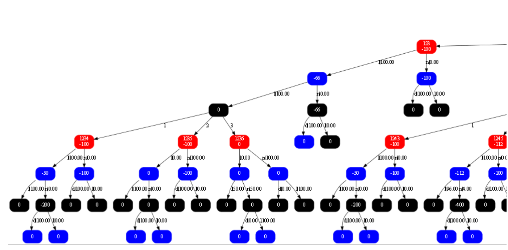

# Training Blueprint and Exploitability Evaluation
We provide a simple example of Leduc Poker about how to build a game tree, how to use MCCFR algorithms to get the Nash equilibrium strategy, and how to evaluate the strategy exploitability by the best response algorithm. It is easy to run the program. 



## Leduc Poker Agent Using MCCFR

* Supported Training methods:
  * External Sampling
  * Chance Sampling

## Requirements
* For C++11 support
* GraphViz software

## Installation
* Clone repositories:
```
$ git clone https://github.com/zqbAse/PokerAI_Sim.git
```

* Compile and Run:
```shell
$ cd zqbAse/PokerAI_Sim
$ g++ blueprint.cpp -o blueprint.o -std=c++11
$ ./blueprint.o
```


## Project Frameworks
```
├── Tree            # game tree code
│   ├── Node.h              # data structure of every node in game tree
│   ├── Bulid_Tree.h        # traverse every possible hole card, community cards and legal actions to bulid the game tree
│   ├── Exploitability.h    # it compute the exploitability of game tree policy
│   ├── Save_load.h         # it can save game tree policy to a file and load file to bulid a game tree
│   └── Visualize_Tree.h    # Visualize game Tree
│
├── Util            # 
│   └── Randint.h           # the class is to generate random number
│
├── img             # game tree figure
│
├── Poker           # the foundation class of the poker game
│   ├── Card.h              # every card class, it's id range from 0 to 5, which map figure 1 to 6
│   ├── Deck.h              # deck class of cards, it contains 6 cards
│   ├── Engine.h            # it compute game result, judging win person and the person can get the number of chips
│   ├── Player.h            # player class,it's attributes contain initial chips, bet chips, small or big blind
│   ├── Table.h             # it's attributes contain players, pot and community cards
│   └── State.h             # it is game state, contain every players infoset
│
└── blueprint.cpp   # it is main algorithm of mccfr
```

## The Detail of Poker folder

the foundation class of the poker game. 
##### Card.h
* every card class, it's id range from 0 to 5, which map figure 1 to 6.
##### Deck.h
* deck class of cards, it contains 6 cards.
##### Engine.h
* it compute game result, judging win person and the person can get the number of chips.
##### Player.h
* player class,it's attributes contain initial chips, bet chips, small or big blind. 
it's functions contain raise, call and fold.
##### Table.h
* it's attributes contain players, pot and community cards.
##### State.h
it is game state, contain every players infoset.  
* constructor function contian deal every player hole card, three community cards and have mapped (hole card,community cards) to a branch in chance node.
* function **reset_game()** is reset game to initial game.  
* function **move_to_next_player()** is that after a player takes action, turning to next player who can take action.  
* function **reset_betting_round_state()** is to control raise chips and check situation.  
* function **is_terminal()** is to judge game over, including one player remained or river round over.  
* function **payout(int i)** is to compute player i winning or losing chips.  
* function **apply_action(char actionstr)** is that when a player take action, game state is change.  
* function **increment_stage()** is that when every game round over, turning to next round.  
* function **legal_actions()** is to return legal actions in current state. 

## The Detail of Poker folder
##### Node.h
* data structure of every node in game tree.
##### Bulid_Tree.h
* traverse every possible hole card, community cards and legal actions to bulid the game tree.
##### Exploitability.h
* it compute the exploitability of game tree policy.
##### Save_load.h
* save or load the game tree policy. 
it can save game tree policy to a file and load file to bulid a game tree.
##### Visualize_Tree.h
* Visualize game Tree.After the game run out, current folder will generate a 'blueprint_sim.stgy' file.
```shell
$ cd GraphViz/bin
$ dot -Tpng blueprint_sim.stgy > temp.png
```
* temp.png is the game tree.
